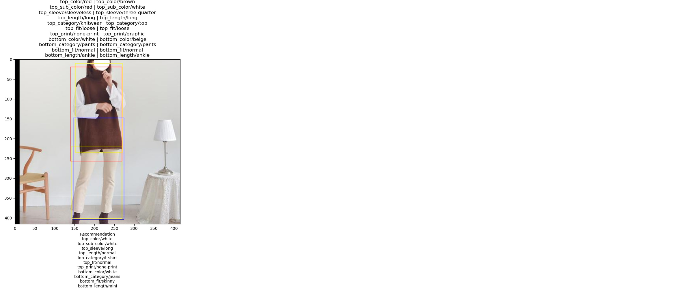
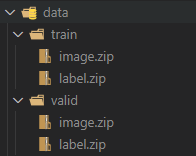

# How to train

```
python src/main.py --mode train --epochs 50 --batch_size 16
```
batch_size를 16으로 하여 총 50 epochs의 학습을 진행합니다.

---

# How to test

```
python src/main.py --mode test
```
테스트 결과는 result/test_by_validset.jpg로 저장됩니다.

노란색 박스는 Validation의 정답 박스이며, 빨간색 박스는 상의, 파란색 박스는 하의 박스를 의미합니다.
각 이미지의 위에는 정답 라벨링과 모델이 추론한 라벨링이 표시됩니다.
이미지의 아래에는 모델이 추론한 라벨링을 바탕으로 상, 하의의 추천 결과를 출력합니다.

---

# Arguments

* --mode(default=train)
  * train(default)
  * test
* --epochs(default=30)
  training을 수행할 epoch입니다.
* --batch_size(default=32)
  training이나 testing을 수행할 batch_size입니다
* --log_freq(default=1)
  train 과정중 log_freq 간격으로 로그와 모델 weight를 저장합니다
* --checkpoint(default=model/yolo_ver2_50.pt)
  test 모드에서 로드할 weight 파일입니다.
  train 모드에서는 이어서 학습을 시작할 모델이 들어갑니다
  처음부터 학습을 진행하려면 model/yolo_0.pt를 이용합니다

---

# Data Path

data 디렉토리에 train, valid가 있으며 각 이미지와 라벨은 .zip 파일로 압축되어 있습니다
train, valid 모두 디렉토리 안에 image.zip, label.zip이 있어야합니다.

[데이터 폴더 구글 드라이브](https://drive.google.com/drive/folders/1BlVZ590-SA7jEG3fmMgDZpGqU0NgaQ7V?usp=sharing)



---

# Requirements

추가로 사용한 패키지는 다음과 같습니다.

[tqdm](https://github.com/tqdm/tqdm/) 진행상황을 확인하기 위한 progressbar 패키지 입니다